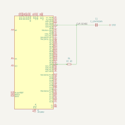
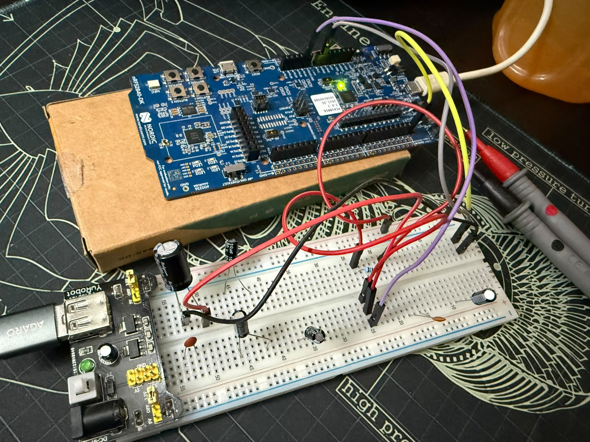
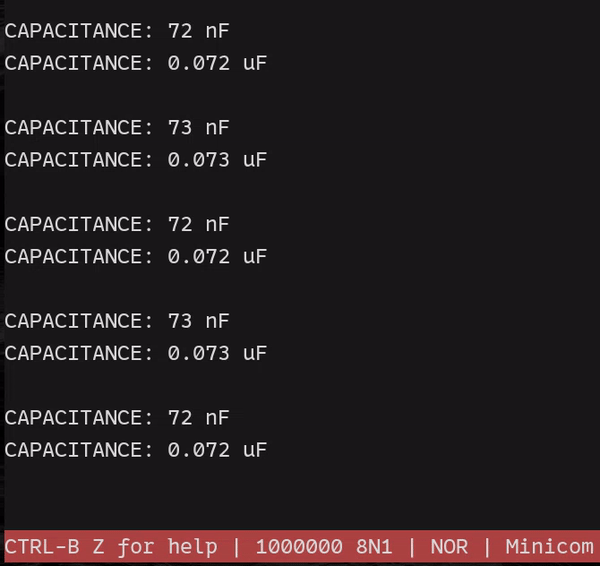
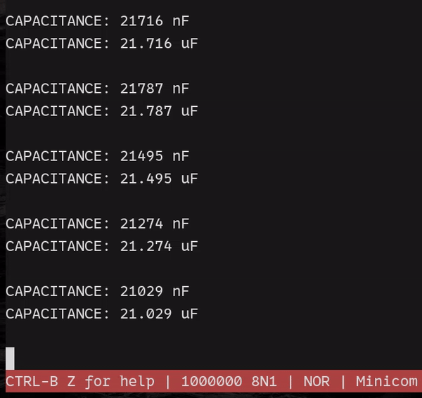
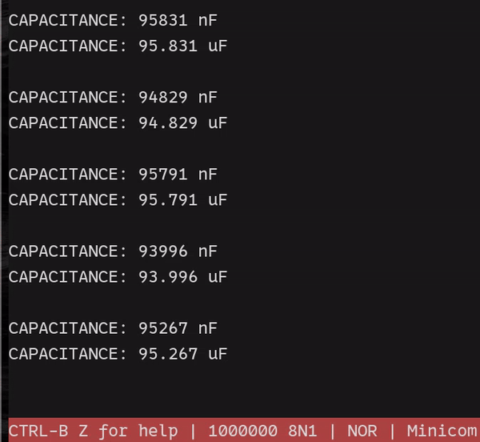
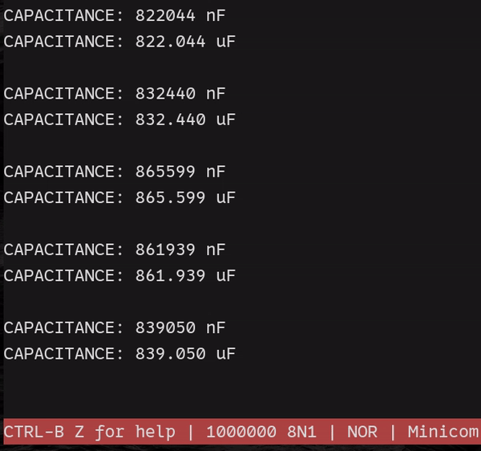

# nrf52840-capacitance-meter

A simple [nRF52840](https://www.nordicsemi.com/Products/nRF52840)-based learning project for measuring capacitor values
using RC timing, SAADC measurements, and a hardware timer.

## RC Circuit

<p align="center">
  
</p>

## How it works

The capacitor is charged and discharged through a known resistor using GPIO P0.27. The capacitor voltage is measured at
the RC junction using P0.04 / AIN2.

For a charging capacitor:

```math
V_C(t) = V_{final}\left(1 - e^{-t/RC}\right)
```

After one time constant, $t = RC$, the capacitor reaches approximately 63.2% of its final voltage:

```math
V_C(RC) \approx 0.632V_{final}
```

The firmware first discharges the capacitor close to 0 V, then starts charging it while sampling the voltage through the
SAADC. A hardware timer measures the elapsed time until the voltage crosses the ~63.2% threshold.

With the resistance known, capacitance is calculated from:

```math
C = \frac{t}{R}
```

The meter has been tested across several capacitor values, with measurements compared against a multimeter.

## Hardware

<p align="center">
  
</p>

<p align="center">
  <em>Breadboard setup used for testing the capacitance meter.</em>
</p>

## Implementation

- Bare-metal firmware without an SDK or RTOS
- GPIO-controlled capacitor charge/discharge
- 12-bit SAADC measurements using EasyDMA
- Hardware timer with 1 µs resolution
- Integer-based voltage and capacitance calculations
- UARTE output for measurement results

### Serial output

UARTE output can be viewed with [Minicom](https://www.man7.org/linux/man-pages/man1/minicom.1.html) at 1M baud:

```shell
minicom -D /dev/ttyACM0 -b 1000000
```

## Measurements

**0.1 µF disc capacitor**

<p align="left">
  
</p>

<p align="left">
  <em>Reference (multimeter): 75.7 pF</em>
</p>

**10 µF electrolytic capacitor**

<p align="left">
  
</p>

<p align="left">
  <em>Reference (multimeter): 10.06 µF</em>
</p>

**22 µF electrolytic capacitor**

<p align="left">
  
</p>

<p align="left">
  <em>Reference (multimeter): 22.47 µF</em>
</p>

**100 µF electrolytic capacitor**

<p align="left">
  
</p>

<p align="left">
  <em>Reference (multimeter): 100.5 µF</em>
</p>

**1000 µF electrolytic capacitor**

<p align="left">
  
</p>

<p align="left">
  <em>Reference (multimeter): 877 µF</em>
</p>

<p align="left">
  <em>Note: Larger capacitors take longer to measure because the charging time increases with the RC time constant, τ = RC.</em>
</p>

## Measurement results

| Capacitor | Multimeter reference | Firmware average |  Error |
| --------: | -------------------: | ---------------: | -----: |
|    0.1 µF |              75.7 nF |         ~72.4 nF | ~4.36% |
|     10 µF |             10.06 µF |        ~9.488 µF | ~5.69% |
|     22 µF |             22.47 µF |       ~21.460 µF | ~4.49% |
|    100 µF |             100.5 µF |       ~95.143 µF | ~5.33% |
|   1000 µF |               877 µF |      ~844.214 µF | ~3.74% |

**Calculation**

```math
\text{Error (\%)} =
\frac{\left|\text{Firmware} - \text{Reference}\right|}
{\text{Reference}}
\times 100
```

## Progress

See [PROGRESS.md](PROGRESS.md) for the implementation checklist.

## Notes

- Some low-level code is reused from my earlier [nRF52840 bare-metal project](https://github.com/codetit4n/nrf52840-baremetal).
- The UARTE logging code is based on [this code](https://github.com/codetit4n/nrf52840-baremetal/blob/main/uarte-tx-only/src/main.c)
  from that project. Read more about it [here](https://loke.sh/blog/nrf52840-web-server/1-nrf52840-baremetal/#uarte-transmit-only-minimal-logger).
